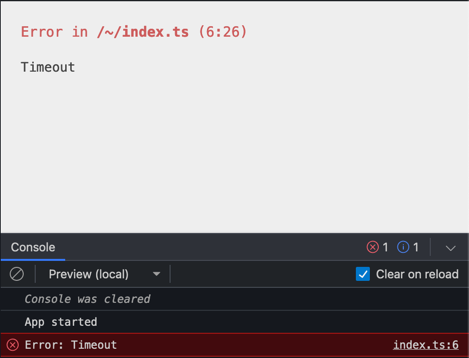
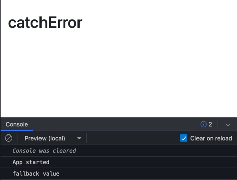
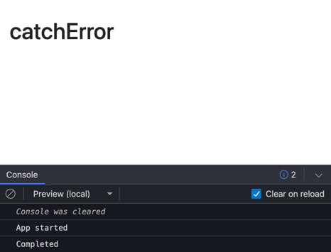

# RxJS 7 and Observables: Introduction
## Getting Started
### Overview
**RxJS** = Reactive Extensions for Javascript

"RxJS is a library for composing asynchronous and event-based programs by using observable sequences. It provides one core type, the *Observable*, satellite types (Observer, Schedulers, Subjects) and operators inspired by Array methods (map, filter, reduce, every, etc) to allow handling asynchronous events as collections

    Think of RxJS as Lodash for events.

ReactiveX combines the *Observer pattern* with the *Iterator pattern* and *functional programming with collections* to fill the need for an ideal way of managing sequences of events."
(https://rxjs.dev/guide/overview)
      
The essential concepts in RxJS which solve async event management are:  
**Observable:** represents the idea of an invokable collection of future values or events.  
**Observer:** is a collection of callbacks that knows how to listen to values delivered by the Observable.  
**Subscription:** represents the execution of an Observable, is primarily useful for cancelling the execution.    
**Operators:** are pure functions that enable a functional programming style of dealing with collections with operations like map, filter, concat, reduce, etc.
**Subject:** is equivalent to an EventEmitter, and the only way of multicasting a value or event to multiple Observers.   
**Schedulers:** are centralized dispatchers to control concurrency, allowing us to coordinate when computation happens on e.g. setTimeout or requestAnimationFrame or others.  
(https://rxjs.dev/guide/overview)

### Quick Start
Lets try some things with observables. 

```ts
name$.subscribe(value => console.log(value)); 
```
emits 3 values.

```ts
storeDataOnServer('Some value');
```
storeDataOnServer returns an observable but nothing happens so far...

with added subscription...
```ts    
storeDataOnServer('Some value').subscribe(value => console.log(value));
```
... it stores the value.

add error handler the old way via callbacks
```ts
storeDataOnServerError('Some value').subscribe(
  value => console.log(value),
  err => console.log('Error when saving: ', err.message)
);
```

use an **observer object** instead:
```ts
storeDataOnServerError('Some value').subscribe({
  next: value => console.log(value),
  error: err => console.log('Error when saving: ', err.message)
});
```

# Observable - how does it work
## Array vs Stream

Array - immediate access to all members  
Stream - items can come at various points in time

--> reaktive Programming

## Key elements 

**Observable:**  
Simply put, an observable is just an object that holds the declaration of an asynchronous behaviour specified via 
callbacks.
When the Observable is executed there are 3 types of notifications/callbacks:  
*next*, *error* and *complete*. 
```ts
const observable$ = new Observable(subscriber => {
    subscriber.next('Alica');
    subscriber.next('Ben');
})
```

**Observer:**  
Describes the reaction to each emitted value.
```ts
const observer = {
    next: value => console.log(value)
}
```

**Subscription:**  
runs the observable and connects the **Observer** and the **Observable**. The subscription must be closed.
```ts
const subscription = observable$.subscribe(observer); 
...
subscription.unsubscribe(); 
```

Workflow:  
The *subscription* runs first. Then the callbacks of the *observable* are executed. This executes then on each next call the 
*observer* code. 

subscription (by subscribe on the observable) -> observable -> observer 

*--> Warm-up Observable - Observable, Observer, Subscription*

## Multiple Subscriptions

Each new subscription runs the code inside the observable independantly. 
Subscribing is just like running a regular function with an observer wrapped into a Subscriber object as argument 
passed to the Observable's logic (which is therefore executed).

*--> Warm-up Observable - multiple Subscriptions*

## Marbles

if nothing is emmitted:  
`-------------------------------------------------> time`

If A, B and C is emitted (via next):   
`----A----B----------------C---------------------->`

with complete (|):  
`----A----B----------------C-----------|---------->`

With error (X):  
`----A----B----------------C-----------X---------->`

getting an error notification.

Notification types:  

| Symbol | Name     | Description |
|--------|----------|-------------| 
| A      | next     | 0..many     | 
| X      | error    | 0..1        |
| \|     | complete | 0..1        |

### illegal scenarios

`----A----B-------|--------C---------------------->`

`----A----B-------X--------C---------------------->`

`----A----B-------X---|--------------------------->`

### Appearance

`----A----B-------C--------D------E--------------->`

Sometimes numbers are used when they show the logic of the operator in a better way:   
`----5----8-------5-----(-1)------7--------------->`

Sometimes Colors are used. Lastly marbles are presented in an ASCII form as I did it here :.)

### Documentation

RxJS Marbles (https://rxmarbles.com/)  
RxJS (https://rxjs.dev/)

# Exercises: Observable, Observer and Subscription
## Subscription Lifecycle

`.subscribe()` creates a subscription (starts Observalbe execution).
Each `next` notification is handled by the Observers `next` handler.
When an `error` is emitted it is handled by the Observers `error` handler.
Finally the `complete` event will be handled by the Observers `complete` handler.

The `error` and `complete` events also run the *teardown* logic of the Observable (so that it can clean up after itself).
This is also done by calling `.unsubscribe()`. In fact the *teardown* logic will always be run.

## Execution Timing - Empty Observable

`------------------------------------------------->`  
*--> Execution Timing - Empty Observable*
```ts
import { Observable } from 'rxjs';

const observable$ = new Observable((subscriber) => {
  console.log('Observable executed');
});

console.log('Before subscription');
observable$.subscribe();
console.log('After subdscribe');
```
Key takeaway is here that there is no asynchronous handling here. The code inside the Observable is executed immediately.

## Synchronous Emmission - Next Notification
`A------------------------------------------------>`  
*--> Synchronous Emmission - Next Notification*
```ts
import { Observable } from 'rxjs';

const observable$ = new Observable<string>((subscriber) => {
    console.log('Observable executed');
    subscriber.next('Alice');
});

console.log('Before subscription');
observable$.subscribe((value) => console.log(value));
console.log('After subdscribe');
```

## Asynchronous Emmission - More Next Notification
`AB----C------------------------------------------>`  
*--> Asynchronous Emmission - More Next Notification*
```ts
import { Observable } from 'rxjs';

const observable$ = new Observable<string>((subscriber) => {
    console.log('Observable executed');
    subscriber.next('Alice');
    subscriber.next('Ben');
    setTimeout(() => subscriber.next('Charlie'), 2000);
});

console.log('Before subscription');
observable$.subscribe((value) => console.log(value));
console.log('After subdscribe');
```
Charlie is now handled asynchronously.

## Teardown - Complete Notification
`AB----C|----------------------------------------->`  
*--> Teardown - Complete Notification*
```ts
import { Observable } from 'rxjs';

const observable$ = new Observable<string>((subscriber) => {
    console.log('Observable executed');
    subscriber.next('Alice');
    subscriber.next('Ben');
    setTimeout(() => {
        subscriber.next('Charlie');
        subscriber.complete();
    }, 2000);

    return () => {
        console.log('Teardown');
    };
});

console.log('Before subscription');
observable$.subscribe({
    next: (value) => console.log(value),
    complete: () => console.log('Completed'),
});
console.log('After subscribe');
```

## Error Notification
`AB----C----X------------------------------------->`  
*--> Error Notification*
```ts
import { Observable } from 'rxjs';

const observable$ = new Observable<string>((subscriber) => {
    console.log('Observable executed');
    subscriber.next('Alice');
    subscriber.next('Ben');
    setTimeout(() => {
        subscriber.next('Charlie');
    }, 2000);
    setTimeout(() => subscriber.error(new Error('Failure')), 4000);

    return () => {
        console.log('Teardown');
    };
});

console.log('Before subscribe');
observable$.subscribe({
    next: (value) => console.log(value),
    complete: () => console.log('Completed'),
    error: (error) => console.log(error.message),
});
console.log('After subscribe');
```

## Order
`AB----X----C|------------------------------------->`  
*--> Order*
```ts
import { Observable } from 'rxjs';

const observable$ = new Observable<string>((subscriber) => {
    console.log('Observable executed');
    subscriber.next('Alice');
    subscriber.next('Ben');
    setTimeout(() => subscriber.error(new Error('Failure')), 2000);
    setTimeout(() => {
        subscriber.next('Charlie');
        subscriber.complete();
    }, 4000);

    return () => {
        console.log('Teardown');
    };
});

console.log('Before subscribe');
observable$.subscribe({
    next: (value) => console.log(value),
    complete: () => console.log('Completed'),
    error: (error) => console.log(error.message),
});
console.log('After subscribe');
```

## Cancellation - Unsubscribe
`----1----2----3---->`  
*--> Cancellation - Unsubscribe*
```ts
import { Observable } from 'rxjs';

const interval$ = new Observable<number>((subscriber) => {
    let counter = 1;
    setInterval(() => {
        console.log('Emitted:', counter);
        subscriber.next(counter++);
    }, 2000);
});

console.log('Before subscribe');
const subscription = interval$.subscribe((value) => console.log(value));
console.log('After subscribe');

setTimeout(() => {
    subscription.unsubscribe();
    console.log('Unsubscribe');
}, 7000);
```
If we run it, we can see there is still a problem. Our Observable is still emitting values because it is not cleaned up
properly. To do that we can fix the code:
```ts
import { Observable } from 'rxjs';

const interval$ = new Observable<number>((subscriber) => {
    let counter = 1;
    const intervalId = setInterval(() => {
        console.log('Emitted:', counter);
        subscriber.next(counter++);
    }, 2000);

    return () => {
        clearInterval(intervalId);
    };
});

console.log('Before subscribe');
const subscription = interval$.subscribe((value) => console.log(value));
console.log('After subscribe');

setTimeout(() => {
    subscription.unsubscribe();
    console.log('Unsubscribe');
}, 7000);
```
# Types of Observables
## Cold Observables

`-----A----B----C--------------------------->`

`.....-----A----B----C--------------------------->`

All values are produced ***independantly*** for each subscription. 

## Cold - Http Request

`---------------C|-------------------------->`

`-----B|------------------------------------>`

`-------------------------X----------------->`

*--> Cold Observables*  
We use Random Data API for our requests (https://random-data-api.com/).
```ts
import { ajax } from 'rxjs/ajax';

ajax('https://random-data-api.com/api/name/random_name').subscribe((data) =>
  console.log(data)
);
```
But to see our Observable works independant on each subscription we can extend our example a bit:
```ts
import { ajax } from 'rxjs/ajax';

const ajax$ = ajax('https://random-data-api.com/api/name/random_name');

ajax$.subscribe((data) => console.log('Sub 1:', data.response.first_name));

ajax$.subscribe((data) => console.log('Sub 2:', data.response.first_name));

ajax$.subscribe((data) => console.log('Sub 3:', data.response.first_name));
```
## Hot Observables

1st subscription:  
`mouse events ---A---------B---C--------D---E--------->`

2nd subscription:  
`.....................-----B---C--------D---E--------->`

3rd subscription:  
`...................................----D---E--------->`

Each subscription gets the same events simultaniously.
*--> Hot Observables*

```ts
import { Observable } from 'rxjs';

const helloButton = document.querySelector('button#hello');

const helloClick$ = new Observable((subscriber) => {
    helloButton.addEventListener('click', (event) => {
        subscriber.next(event);
    });
});

helloClick$.subscribe((event) =>
    console.log('Sub 1: ', event.type, event.x, event.y)
);

setTimeout(() => {
    console.log('subscription 2 starts');
    helloClick$.subscribe((event) =>
        console.log('Sub 2: ', event.type, event.x, event.y)
    );
}, 5000);
```
## Hot vs Cold - Comparison

| COLD                      | HOT                                      |
|---------------------------|------------------------------------------|
| Produces the data insid e | Multicasts the data from a common source |
| New Subscriber - new data | All Subscribers - common data            |
| Set of values             | DOM events                               |
| Http Request              | State                                    |
| Timer/Interval            | Subjects                                 |

# Creation Functions
 
`of, from, fromEvent, interval/timer, forkJoin, combineLatest`

these are also called creation operators.

## of - How Creation Functions work
*--> of - How Creation Functions work*

```ts
import { of } from 'rxjs';

of('Alice', 'Ben', 'Charlie').subscribe((value) => console.log(value));
```
And we can see that all values were emitted immediatly after subscribing.

It also emits a complete notification directly after emitting the last value:
```ts
import { of } from 'rxjs';

of('Alice', 'Ben', 'Charlie').subscribe({
  next: (value) => console.log(value),
  complete: () => console.log('Completed'),
});
```
We can compare this with the standard Observable implementation:
```ts
import { Observable, of, Subscriber } from 'rxjs';

of('Alice', 'Ben', 'Charlie').subscribe({
  next: (value) => console.log(value),
  complete: () => console.log('Completed'),
});

const names$ = new Observable<string>((subscriber) => {
  subscriber.next('Alice');
  subscriber.next('Ben');
  subscriber.next('Charlie');
  subscriber.complete();
});

names$.subscribe({
  next: (value) => console.log(value),
  complete: () => console.log('Completed'),
});
```
If we implement the of creation function our selves, it would look like this:
```ts
import { Observable, of, Subscriber } from 'rxjs';

ourOwnOf('Alice', 'Ben', 'Charlie').subscribe({
  next: (value) => console.log(value),
  complete: () => console.log('Completed'),
});

function ourOwnOf(...args: string[]): Observable<string> {
  return new Observable<string>((subscriber) => {
    args.forEach((value) => subscriber.next(value));
    subscriber.complete();
  });
}
```
## from

`from([A, B, C])`: The `from` creation function works with an array as input elements (instead of multiple arguments).  
`from(Promise)`: Another popular usage is with a Promise. The Promise's resolve value will be emitted as a next notification and then 
it will complete. If the promise is rejected the from function will notify with an error.   

*--> from*  
```ts
import { from } from 'rxjs';

from(['Alice', 'Ben', 'Charlie']).subscribe({
  next: (val) => console.log(val),
  complete: () => console.log('Completed'),
});
```
With a Promise:
```ts
import { from } from 'rxjs';

const somePromise = new Promise((resolve, reject) => {
  resolve('Resolved');
});

const observableFromPromise$ = from(somePromise);

observableFromPromise$.subscribe({
  next: (val) => console.log(val),
  complete: () => console.log('Completed'),
});
```
... and if the Promise is rejected:
```ts
import { from } from 'rxjs';

const somePromise = new Promise((resolve, reject) => {
    //resolve('Resolved');
    reject('Rejected');
});

const observableFromPromise$ = from(somePromise);

observableFromPromise$.subscribe({
    next: (val) => console.log(val),
    complete: () => console.log('Completed'),
    error: (error) => console.log('Error: ', error),
});
```
of course we can also use an Observable as input:
```ts
import { of, from } from 'rxjs';

from(of('Alice', 'Ben', 'Charlie')).subscribe((val) => console.log(val));
```
## fromEvent

... supports multiple event targets:
- DOM EventTarget
- Node.js EventEmitter
- jQuery Events

### DOM EventTarget - fromEvent(button, 'click')

`subscribe()` will work like `addEventListener()`
`unsubscribe()` will work like `removeEventListener()`

DOM events:  
`--------A--------B-----C---------D----------------->`

our subscription:  
`.............----B-----C---------D->`

We need to unsubscribe() because the DOM events will never complete.
It is a hot Observable:  
`...................----C----->`

*--> DOM EventTarget - fromEvent(button, 'click')*
```ts
import { fromEvent } from 'rxjs';

const triggerButton = document.querySelector('button#trigger');

fromEvent<MouseEvent>(triggerButton, 'click').subscribe((event) =>
  console.log(event.type, event.x, event.y)
);
```
As a standard Observable implemetation this would look like:
```ts
import { fromEvent, Observable } from 'rxjs';

const triggerButton = document.querySelector('button#trigger');

const triggerClick$ = new Observable<MouseEvent>((subscriber) => {
  triggerButton.addEventListener('click', (event) => {
    subscriber.next(event);
  });
});

triggerClick$.subscribe((event) => console.log(event.type, event.x, event.y));
```
We can put a cleanup with unsubscribe:
```ts
import { fromEvent } from 'rxjs';

const triggerButton = document.querySelector('button#trigger');

const subscription = fromEvent<MouseEvent>(triggerButton, 'click').subscribe(
  (event) => console.log(event.type, event.x, event.y)
);

setTimeout(() => {
  console.log('Unsubscribe');
  subscription.unsubscribe();
}, 5000);
```
Wich would look in our own implementation like this:
```ts
import { Observable } from 'rxjs';

const triggerButton = document.querySelector('button#trigger');

const triggerClick$ = new Observable<MouseEvent>((subscriber) => {
  triggerButton.addEventListener('click', (event) => {
    subscriber.next(event);
  });
});

const subscription = triggerClick$.subscribe((event) =>
  console.log(event.type, event.x, event.y)
);

setTimeout(() => {
  console.log('Unsubscribe');
  subscription.unsubscribe();
}, 5000);
```
But be aware this needs more to cleanup:
```ts
import { Observable } from 'rxjs';

const triggerButton = document.querySelector('button#trigger');

const triggerClick$ = new Observable<MouseEvent>((subscriber) => {
  const clickHandlerFn = (event) => {
    console.log('Event callback executed');
    subscriber.next(event);
  };

  triggerButton.addEventListener('click', clickHandlerFn);

  return () => {
    triggerButton.removeEventListener('click', clickHandlerFn);
  };
});

const subscription = triggerClick$.subscribe((event) =>
  console.log(event.type, event.x, event.y)
);

setTimeout(() => {
  console.log('Unsubscribe');
  subscription.unsubscribe();
}, 5000);
```
## timer

Is similar to the setTimeout Function. After the interval a next notification is emitted with the value '0' followed by
a complete notification.  
`...-------0|------>`

*--> timer*
```ts
import { timer } from 'rxjs';

console.log('App started');

timer(2000).subscribe({
  next: (val) => console.log(val),
  complete: () => console.log('Completed'),
});
```
If we would implement it on our own:
```ts
import { Observable } from 'rxjs';

console.log('App started');

const timer$ = new Observable((subscriber) => {
  setTimeout(() => {
    subscriber.next(0);
    subscriber.complete();
  }, 2000);
});

timer$.subscribe({
  next: (val) => console.log(val),
  complete: () => console.log('Completed'),
});
```
But yet it doesn't behave fully like the `timer` function. If extend the previous example a bit we can see why:
```ts
import { timer } from 'rxjs';

console.log('App started');

const subscription = timer(2000).subscribe({
  next: (val) => console.log(val),
  complete: () => console.log('Completed'),
});

setTimeout(() => {
  console.log('Unsubscribe');
  subscription.unsubscribe();
}, 1000);
```
Now the next notification does never happen because it is cancelled by the unsubscribe. If we leave the timer proceeding
till it's own termination, there would be no need to unsubscribe. If we do this with our own 
implementation it behaves slightly different:
```ts
import { Observable } from 'rxjs';

console.log('App started');

const timer$ = new Observable((subscriber) => {
  setTimeout(() => {
    console.log('timeout running');
    subscriber.next(0);
    subscriber.complete();
  }, 2000);
});

const subscription = timer$.subscribe({
  next: (val) => console.log(val),
  complete: () => console.log('Completed'),
});

setTimeout(() => {
  console.log('Unsubscribe');
  subscription.unsubscribe();
}, 1000);
```
Here is how to completely clean up with our own impl.:
```ts
import { Observable } from 'rxjs';

console.log('App started');

const timer$ = new Observable((subscriber) => {
  const timoutId = setTimeout(() => {
    console.log('timeout running');
    subscriber.next(0);
    subscriber.complete();
  }, 2000);

  return () => clearTimeout(timoutId);
});

const subscription = timer$.subscribe({
  next: (val) => console.log(val),
  complete: () => console.log('Completed'),
});

setTimeout(() => {
  console.log('Unsubscribe');
  subscription.unsubscribe();
}, 1000);
```

## interval

Is similar to timer but it doesn't stop with the first notification.  
`----0----1----2----3----4-->`  
*--> interval*
```ts
import { interval } from 'rxjs';

console.log('App started');

const subscription = interval(1000).subscribe({
  next: (val) => console.log(val),
  complete: () => console.log('Completed'),
});
```
Now with unsubscribe:
```ts
import { interval } from 'rxjs';

console.log('App started');

const subscription = interval(1000).subscribe({
  next: (val) => console.log(val),
  complete: () => console.log('Completed'),
});

setTimeout(() => {
  console.log('Unsubscribe');
  subscription.unsubscribe();
}, 5000);
```
With our own implementation based on our own for timer:
```ts
import { Observable } from 'rxjs';

console.log('App started');

const interval$ = new Observable((subscriber) => {
  let count = 0;

  const intervalId = setInterval(() => {
    console.log('interval running');
    subscriber.next(count++);
  }, 1000);

  return () => clearTimeout(intervalId);
});

const subscription = interval$.subscribe({
  next: (val) => console.log(val),
  complete: () => console.log('Completed'),
});

setTimeout(() => {
  console.log('Unsubscribe');
  subscription.unsubscribe();
}, 5000);
```
## forkJoin - Handle multiple Http calls

Accepts an array of Observables as input. It will create Subscriptions to all those Observables and wait for them to
complete. After that it will emit a set of their **latest** values.  

This can bew usefull if you'd like to call multiple Http endoints at the same time and need to wait for all of of them 
to respond.

A   
`----------------------A|--------->`   

B  
`----------1|--------------------->`  

`forkJoin([A, B])`  
`----------------------([A,1])|--->`  

*--> forkJoin*
```ts
import { forkJoin } from 'rxjs';
import { ajax, AjaxResponse } from 'rxjs/ajax';

const randomName$ = ajax('https://random-data-api.com/api/name/random_name');
const randomNation$ = ajax(
  'https://random-data-api.com/api/nation/random_nation'
);
const randomFood$ = ajax('https://random-data-api.com/api/food/random_food');

forkJoin([randomName$, randomNation$, randomFood$]).subscribe(
  ([nameAjax, nationAjax, foodAjax]) =>
    console.log(
      `${nameAjax.response.first_name} is from ${nationAjax.response.capital} and likes to eat ${foodAjax.response.dish}`
    )
);
```
Let's say we multiple results on our timelines A and B. The `forkJoin`will no matter what wait until both are completed
and its result will have the last values of both before completion:  
A   
`------A---------B-------------C-|--------->`

B  
`----------1-----------2---|--------------->`

`forkJoin([A, B])`  
`--------------------------------([C,2])|-->`  

### forkJoin - Error Scenarios

A   
`-------A|----------------------->`

B  
`------------------X------------->`

`forkJoin([A, B])`  
`------------------X------------->`  

*--> forkJoin - Error Scenarios*
```ts
import { forkJoin, Observable } from 'rxjs';

const a$ = new Observable((subscription) => {
  setTimeout(() => {
    subscription.next('A');
    subscription.complete();
  }, 5000);

  return () => {
    console.log('A teardown');
  };
});

const b$ = new Observable((subscription) => {
  setTimeout(() => {
    subscription.error('Failure');
  }, 3000);

  return () => {
    console.log('B teardown');
  };
});

forkJoin([a$, b$]).subscribe({
  next: (val) => console.log(val),
  complete: () => console.log('Completed'),
  error: (error) => console.log('Error: ', error),
});
```
Wroth noting here is, that forkJoin cleans up both input Observables as soon as a failure
has occurred.

## combineLatest - Reacting to multiple input changes

... emits a combination of the latest emits of the input Observables each time any of them
emits something new.

A   
`---A-----------------B--------------------------C---------->`

B  
`---------1---------------------2-----------|--------------->`

`combineLatest([A, B])`  
`---------([A,1])----([B,1])----([B,2])----------([C,2])---->`  

combineLatest awaits that it got a next notification from every of the input Observables 
before it emits a combined value.

*--> combineLatest*
```ts
import { combineLatest, fromEvent } from 'rxjs';

const temperatureInput = document.getElementById('temperature-input');
const conversionDropdown = document.getElementById('conversion-dropdown');
const resultText = document.getElementById('result-text');

const temperatureInputEvent$ = fromEvent(temperatureInput, 'input');
const conversionInputEvent$ = fromEvent(conversionDropdown, 'input');

combineLatest([temperatureInputEvent$, conversionInputEvent$]).subscribe(
  ([temperatureInputEvent, conversionInputEvent]) => {
    const temperature = Number(temperatureInputEvent.target['value']);
    const conversion = conversionInputEvent.target['value'];

    let result: number;
    if (conversion === 'f-to-c') {
      result = ((temperature - 32) * 5) / 9;
    } else if (conversion === 'c-to-f') {
      result = (temperature * 9) / 5 + 32;
    }

    resultText.innerText = String(result);
  }
);
```
When an error occurs:  
A   
`---A-----------------B--------------------->`

B  
`---------1---------------------2-----------X--------------->`

`combineLatest([A, B])`  
`---------([A,1])----([B,1])----([B,2])-----X--------------->`  

timeline A will be closed and the failure will be reported.

# Pipe-able Operators

... allow to transform the notifications emitted by an Observable in countless ways.

`filter, map, tap, debounceTime, catchError, concat/switch/mergeMap`

## Operator stacking

Source ---------------> Observer

Source --> Operator --> Observer

The Operator subscribes to the source observable and starts emitting notifications.

Source --> Operator1 --> Operator2 --> Operator3 --> Observer

Operators can be stacked.

## Importing Operators

In the videos in this section, the Pipeable Operators are imported from `"rxjs/operators"`, for example:

`import { filter } from "rxjs/operators";`

Starting from **RxJS v7.2.0** you can import the operators directly from the top level (from "rxjs"), for example:

`import { filter } from "rxjs";`

Thanks to this, you can keep all your RxJS-related imports together:

`import { filter, Observable, Subscription } from "rxjs";`

The original way of importing operators still works, but will be deprecated in the future.

## filter

It's the rxjs counterpart of array filters. If a value is emitted by the source Observable this operator will either 
pass it through to the output Observable or skip it based on the condition provided.

Source  
`----A1--------B2----C1-----------D2------------E1-------------->`

Result  
`--------------B2-----------------D2---------------------------->`

notification pass through    

| notification type | result                                   |
|-------------------|------------------------------------------|
| next              | filter can pass the notification or skip | 
| error             | will be passed                           |
| complete          | will be passed                           |

Source  
`----A1--------B2----C1-----------D2------------E1-------------->`

Result  
`--------------B2-----------------D2---------------------------->`

*--> filter*
```ts
import { Observable } from 'rxjs';
import { filter } from 'rxjs';

interface NewsItem {
  category: 'Business' | 'Sports';
  content: string;
}

const newsFeed$ = new Observable<NewsItem>((subscriber) => {
  setTimeout(
    () => subscriber.next({ category: 'Business', content: 'A' }),
    1000
  );
  setTimeout(() => subscriber.next({ category: 'Sports', content: 'B' }), 3000);
  setTimeout(
    () => subscriber.next({ category: 'Business', content: 'C' }),
    4000
  );
  setTimeout(() => subscriber.next({ category: 'Sports', content: 'D' }), 6000);
  setTimeout(
    () => subscriber.next({ category: 'Business', content: 'E' }),
    7000
  );
});

newsFeed$
  .pipe(filter((item) => item.category === 'Sports'))
  .subscribe((item) => console.log(item.content));
```
As operators produce just a new Observable we can also do this:

```ts
import { Observable } from 'rxjs';
import { filter } from 'rxjs';

interface NewsItem {
  category: 'Business' | 'Sports';
  content: string;
}

const newsFeed$ = new Observable<NewsItem>((subscriber) => {
  setTimeout(
    () => subscriber.next({ category: 'Business', content: 'A' }),
    1000
  );
  setTimeout(() => subscriber.next({ category: 'Sports', content: 'B' }), 3000);
  setTimeout(
    () => subscriber.next({ category: 'Business', content: 'C' }),
    4000
  );
  setTimeout(() => subscriber.next({ category: 'Sports', content: 'D' }), 6000);
  setTimeout(
    () => subscriber.next({ category: 'Business', content: 'E' }),
    7000
  );
});

const sportsNewsFeed$ = newsFeed$.pipe(
  filter((item) => item.category === 'Sports')
);

sportsNewsFeed$.subscribe((item) => console.log(item.content));
```
Naturally we can use the source Observable on its own after we have created the piped one.
```ts
//...

newsFeed$.subscribe((item) => console.log(item.content));
```
## map
The `map` operator is the another counterpart of an array function. It can be used to transform the emitted values.

Source Observable  
`--------3----------4--------1------------>`

`map(x => x * 2)`

Result Observable  
`--------6----------8--------2------------>`

*--> map*
```ts
import { forkJoin } from 'rxjs';
// Mike is from New Delhi and likes to eat pasta.

import { ajax } from 'rxjs/ajax';
import { map } from 'rxjs';

const randomName$ = ajax<any>(
  'https://random-data-api.com/api/name/random_name'
).pipe(map((response) => response.response.first_name));

const randomNation$ = ajax<any>(
  'https://random-data-api.com/api/nation/random_nation'
).pipe(map((response) => response.response.capital));

const randomFood$ = ajax<any>(
  'https://random-data-api.com/api/food/random_food'
).pipe(map((response) => response.response.dish));

forkJoin([randomName$, randomNation$, randomFood$]).subscribe(
  ([first_name, capital, dish]) =>
    console.log(`${first_name} is from ${capital} and likes to eat ${dish}.`)
);
```
## tap

`tap` doesn't affect the notifications at all. It can be useful if we have stacked some pipe operators to watch the 
current state of the transformed notifications. The input notifications will just be reemitted.

*--> tap*
```ts
import { filter, map, of, tap } from 'rxjs';

of(1, 7, 3, 6, 2)
  .pipe(
    filter((val) => val > 5),
    tap((val) => console.log('spy: ', val)),
    map((val) => val * 2)
  )
  .subscribe((val) => console.log('output: ', val));
```
Medium: Information is King — tap() — how to console.log in RxJS 
(https://medium.com/@jaywoz/information-is-king-tap-how-to-console-log-in-rxjs-7fc09db0ad5a)

## debounceTime

next: moved in time
complete: pass through
error: pass through

`--A-------B--C------------------>`

debounceTime(2000)

`-------A----------C------------->`

*--> debounceTime*
```ts
import { fromEvent, debounceTime, map } from 'rxjs';

const sliderInput = document.querySelector('input#slider');

fromEvent(sliderInput, 'input')
  .pipe(
    debounceTime(2000),
    map((evt) => evt.target['value'])
  )
  .subscribe((val) => console.log(val));
```
## catchError

| notification type | handling                                |
|-------------------|-----------------------------------------|
| next              | pass through                            |
| error             | creates an observables and completes it |
| complete          | pass through                            |

`-----A------B-----------------X------------->`

`catchError(error => fallbackObservable$)`  
`..............................(C|)---------->`

`-----A------B-----------------(C|)---------->`

what gets emitted by the fallbackObservable$ will be passed through to the output. If the fallbackObservable$ errors
it will be the final outcome.

*--> catchError*
Let's first create the scenario:
```ts
import { Observable } from 'rxjs';

const failingHttpRequest$ = new Observable((subscriber) => {
    setTimeout(() => {
        subscriber.error(new Error('Timeout'));
    }, 3000);
});

console.log('App started');

failingHttpRequest$.subscribe((value) => console.log(value));
```
this fails with:  


Now let's add the catchError operator:
```ts
import { Observable } from 'rxjs';
import { of } from 'rxjs';
import { catchError } from 'rxjs/operators';

const failingHttpRequest$ = new Observable((subscriber) => {
  setTimeout(() => {
    subscriber.error(new Error('Timeout'));
  }, 3000);
});

console.log('App started');

failingHttpRequest$
  .pipe(catchError((error) => of('fallback value')))
  .subscribe((value) => console.log(value));
```  
  

What can we do to just ignore the error? We can use the Observable:
`EMPTY`

`----A------B----------X------------------>`

`catchError(() => EMPTY)`  
`......................|------------------>`

`----A------B----------|------------------>`
```ts
import { EMPTY, Observable } from 'rxjs';
import { of } from 'rxjs';
import { catchError } from 'rxjs/operators';

const failingHttpRequest$ = new Observable((subscriber) => {
  setTimeout(() => {
    subscriber.error(new Error('Timeout'));
  }, 3000);
});

console.log('App started');

failingHttpRequest$.pipe(catchError((error) => EMPTY)).subscribe({
  next: (value) => console.log(value),
  complete: () => console.log('Completed'),
});
```


## Flattening operators

`concatMap, switchMap, mergeMap, exhaustMap`

notification types:  
next:  
`A`

`-1-(3|)-->`

error: pass through  
complete: pass through

source   
`------A--------------------B------------------------>`

`concatMap(() => newStream$)`   
`.......-1-2-|-->...........-1-2-|-->`

result  
`--------1-2-----------------1-2--------------------->`

### Flattening operators - static example
*--> Flattening operators - static example*
```ts
import { concatMap, Observable, Subscriber } from 'rxjs';
import { of } from 'rxjs';

const source$ = new Observable((subscriber) => {
  setTimeout(() => subscriber.next('A'), 2000);
  setTimeout(() => subscriber.next('B'), 5000);
});

console.log('App started');
source$.pipe(concatMap((val) => of(1, 2))).subscribe((val) => console.log(val));
```

